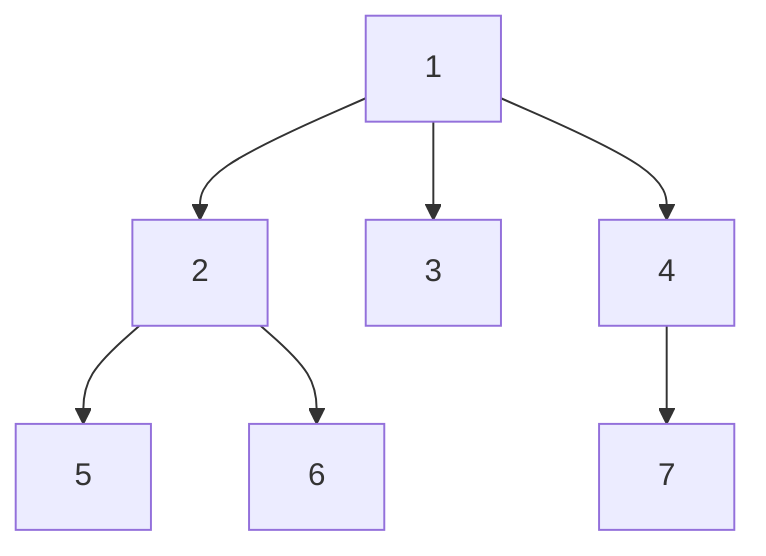
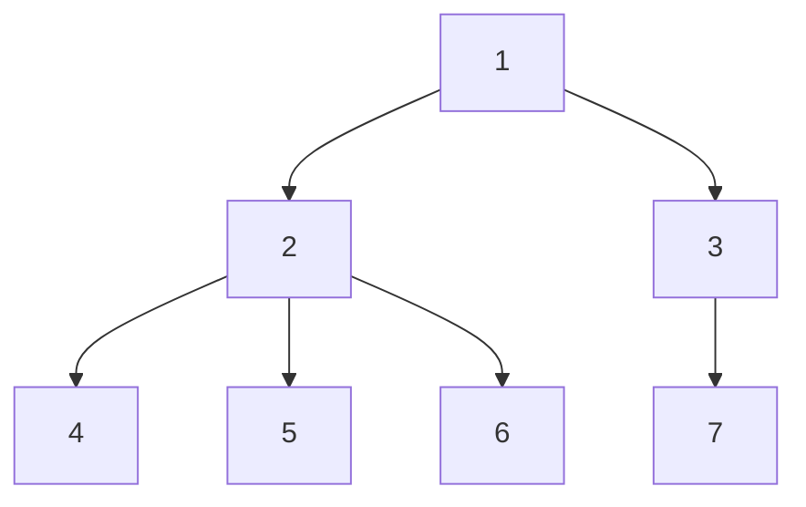
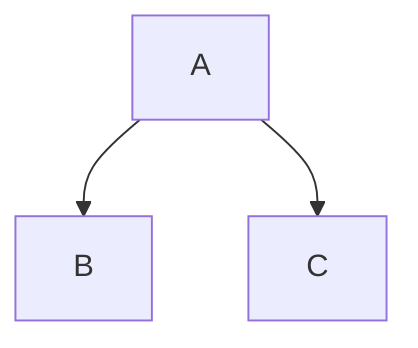
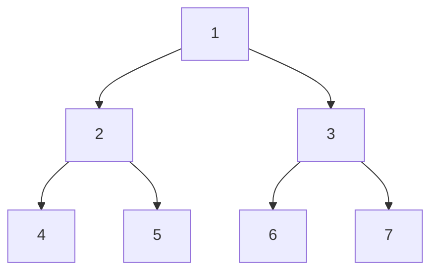
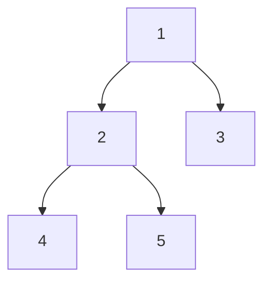
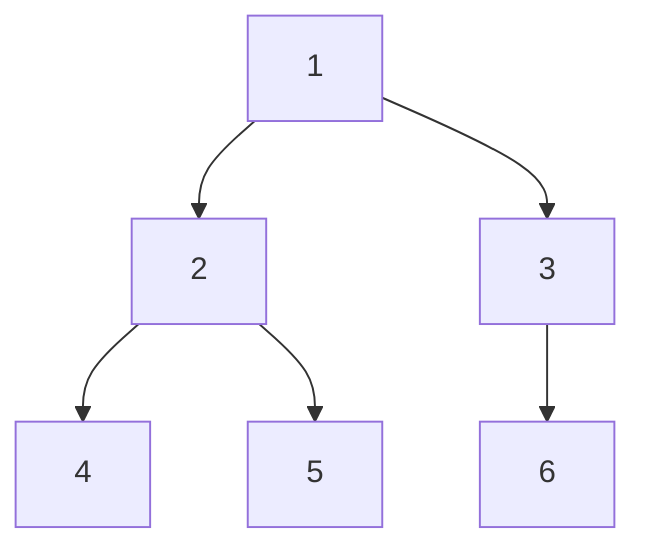
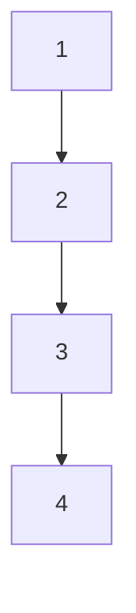

#                                                           Binary Tree - Peak of DSA

## What is a Tree?

A **Tree** is a hierarchical (parent-child) data structure that consists of nodes connected by edges.

### Generic Tree Example



### Important Terms

- **Node** → Basic element of a tree.
- **Root Node** → Topmost node of the tree.
- **Child Node** → Node directly connected below a parent.
- **Parent Node** → Node directly connected above a child.
- **Leaf Node** → Node having no children.
- **Sibling Nodes** → Nodes having the same parent.
- **Ancestor** → Any node on the path from root to a node.
- **Descendant** → Any node below a given node.

---

## Tree Terminology Example



### Observations

- Root Node = **1**
- Child Nodes of 1 = **2, 3**
- Leaf Nodes = **4, 5, 6, 7**
- Siblings = **4, 5, 6**
- Ancestor of 4 = **1, 2**
- Descendants of 2 = **4, 5, 6**

---

## Properties of a Tree

### Size of Tree
Number of nodes in the tree.

Example:

```text
Nodes = {1,2,3,4,5,6,7}
Size = 7
```

### Level of Tree

```text
Level 1 → 1
Level 2 → 2,3
Level 3 → 4,5,6,7
```

Total Levels = **3**

### Height of Tree

```text
Height = Number of Levels - 1
```

For the above tree:

```text
Height = 3 - 1 = 2
```

### Edges

For any tree:

```text
Edges = Nodes - 1
```

Example:

```text
Nodes = 7
Edges = 6
```

---

# Binary Tree

A **Binary Tree** is a tree in which each node can have **at most 2 children**.

```text
0 Child
1 Child
2 Children
```

Allowed:




Not Allowed:

```text
      A
    / | \
   B  C  D
```

(Because a binary tree can have maximum 2 children.)

---

## Perfect Binary Tree

A **Perfect Binary Tree** is a binary tree where:

1. Every internal node has exactly 2 children.
2. All leaf nodes are at the same level.



### Properties

For Height = h

```text
Total Nodes = 2^(h+1) - 1

Leaf Nodes = 2^h

Internal Nodes = 2^h - 1
```

Example:

```text
Height = 2

Total Nodes = 2^(2+1)-1
            = 7

Leaf Nodes = 2^2
           = 4

Internal Nodes = 3
```

---

# Types of Binary Trees

## 1. Full Binary Tree

Every node has either:

- 0 children, or
- 2 children



---

## 2. Complete Binary Tree

- All levels are completely filled except possibly the last level.
- Last level is filled from left to right.



---

## 3. Perfect Binary Tree


All levels completely filled.

---

## 4. Skewed Binary Tree

### Left Skewed



### Right Skewed


(Every node has only one child.)

---

# Quick Revision

| Term | Meaning |
|--------|----------|
| Root | Topmost node |
| Parent | Node having children |
| Child | Node connected below parent |
| Leaf | Node with no children |
| Sibling | Nodes with same parent |
| Ancestor | Previous nodes in path |
| Descendant | Nodes below a node |
| Size | Number of nodes |
| Height | Levels - 1 |
| Edges | Nodes - 1 |
| Binary Tree | Max 2 children per node |
| Full Binary Tree | 0 or 2 children |
| Complete Binary Tree | Last level filled left to right |
| Perfect Binary Tree | All levels completely filled |
| Skewed Tree | Every node has one child |
