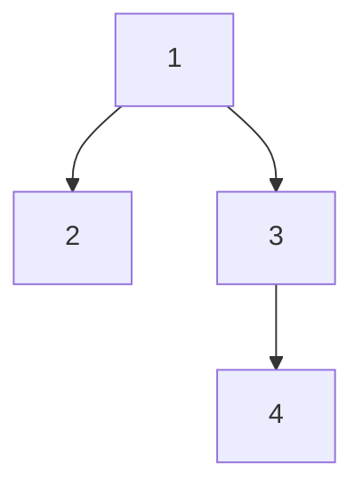

##                                          BINARY TREE - PEAK OF DSA


Tree is Hirarcherical Data Structure
```mermaid
                 1
                / | \
                2 3 4
               /\   |
               5 6  7
```

Tree having Nodes.
Trees can have mutiple next or children
```mermaid
                      1st Node - root Node
                      / \
                      2  3 -> child Node of 1
                      /|\ \
                     4 5 6 7 -> leaf Node - Last Node all the chidren are null
                     -----
                     siblings.  ->   4, 5, 6   
```


anchestor -> purvag -> 1 -> 2 - 4 - 5 - 6 - 3 - 7
2 is anchestor - 4 - 5 - 6 

decendent


size of tree = no of nodes
level of Tree = 3 
height = level - 1
edges (/\) = size - 1


Binary Tree is Called Generic Tree..

Ay Node can have 0,1,2 childs node
Each node have only 2 child is called perfect Binary Tree... 
```mermaid
                                           1
                                        /     \
                                       2       3
                                      /\       /\
                                      4 5     6  7  
```




DFS
Preorder Node Left Right
Postorder Left Right Node
Inorder Left Node Right